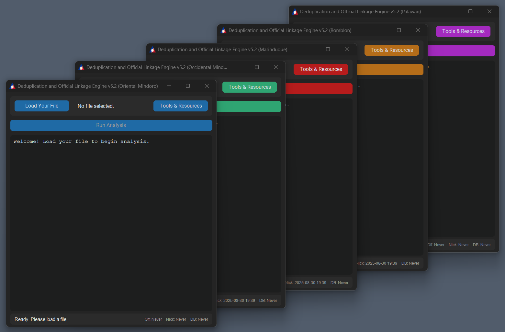
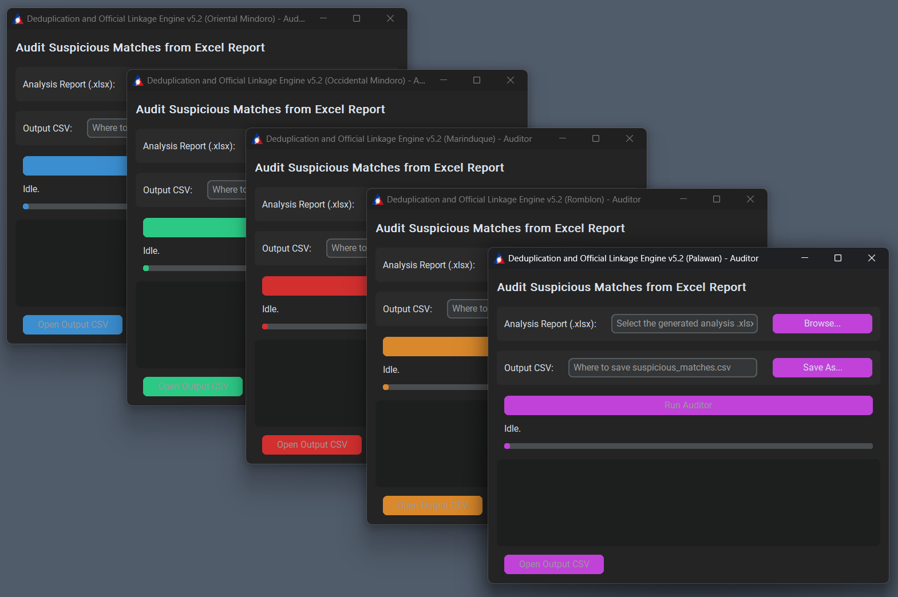
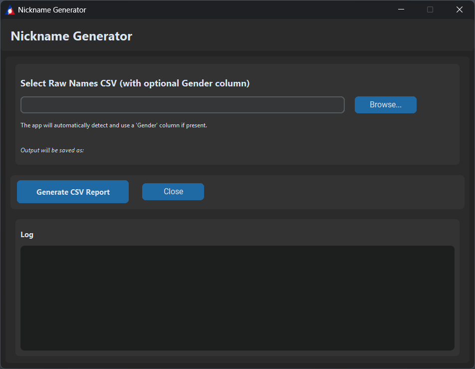
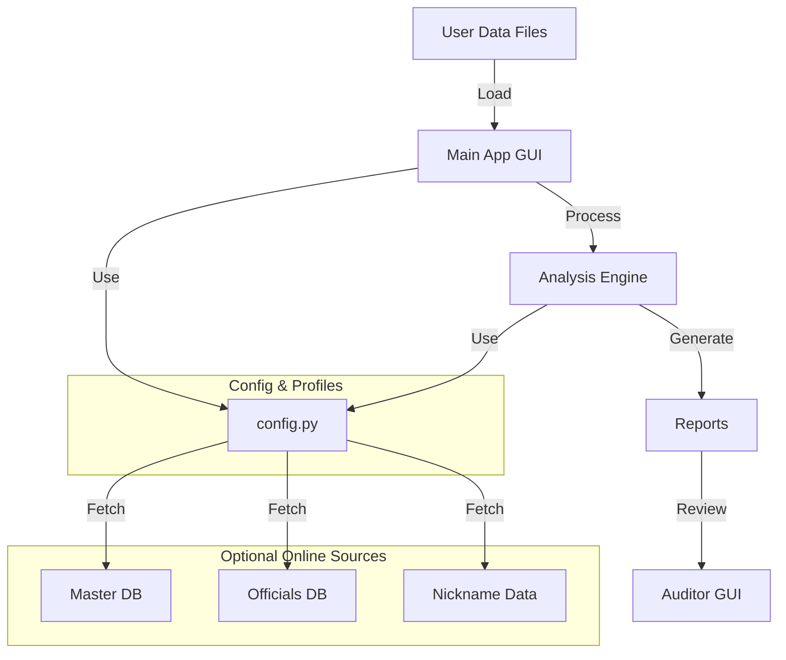
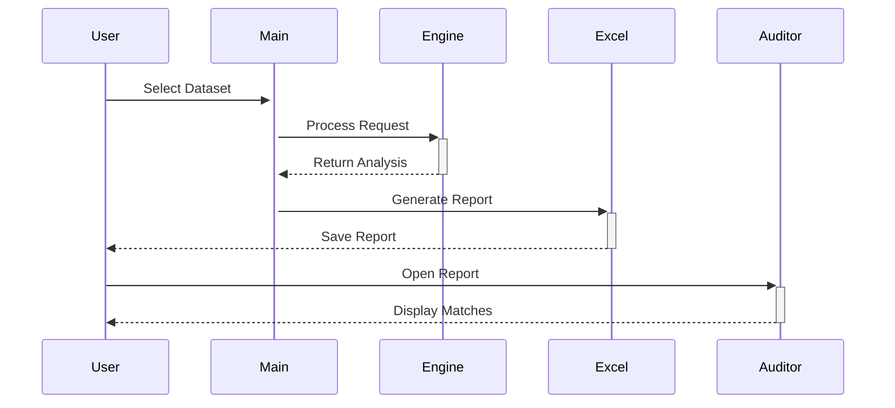

# Deduplication and Official Linkage Engine (DOLE) v1.0.0
Programmed by A. Enage (aenage@gmail.com) — DOLE OrMin Provincial Office

A Windows desktop tool to detect duplicates, link user records to master databases, and flag government officials in beneficiary lists. Ships with dedicated Auditor and Nickname Generator tools.

## Features
- High-accuracy name matching with nickname equivalence, phonetics, and fuzzy ratios.
- Three match classes: Exact, Fuzzy, and No Match.
- Generates a formatted Excel report (Dashboard, User File Data, Analysis Report).
- Optional PDF export via Microsoft Excel automation.
- Standalone Auditor GUI to review “suspicious matches.”
- Standalone Nickname Generator GUI.

## Screenshots
*Main Application Interface*

*Auditor Tool*

*Nickname Generator*

## OS Compatibility (Important)
- Supported: Windows 8.1, 10, 11; Windows Server 2012 R2 and newer.
- Not supported: Windows XP, Vista, 7; Windows Server 2008/2008 R2/2012.

Reason: The app targets Python 3.13 and PyInstaller 6.x, which require Windows 8.1+; some dependencies (e.g., pandas, cryptography) also require modern Windows APIs.

## System Requirements
- For running prebuilt .exe: Supported Windows (see above). No Python required.
- For PDF export: Microsoft Excel (desktop, licensed) for COM automation (`pywin32`).
- For running from source: Python 3.13 (64-bit) and the packages in `requirements.txt`.

### Python Compatibility
* __Tested version__: Python 3.13.7 (64-bit) on Windows 10/11.
* __Expectations__: Python 3.13 is fully supported. Earlier 3.10–3.12 may work but are not part of current validation. Use the pinned deps in `requirements.txt`.
* __Build toolchain__: PyInstaller 6.x (project pins 6.14.x) is used for packaging and is compatible with Python 3.13.

## Project Structure
- `main.py` – App entry point and GUI logic.
- `gui.py` – UI components, dialogs, theming, About dialog.
- `analysis_engine.py` – Matching logic and report generation.
- `excel_converter.py` – Excel-to-PDF via COM (requires MS Excel).
- `auditor.py` – Auditor logic and GUI for suspicious match review.
- `nickname_generator.py` – Self-contained Nickname Generator GUI.
- `build.py` – PyInstaller build menu for province-specific builds and tools.
- `config.py` – Config (report format, themes, province profiles, thresholds).
- `requirements.txt` – Python dependencies and versions.

## Overview (for Regional Technical Division)
This tool targets government programs that must ensure only one beneficiary record per person per year. It detects nuanced attempts to re-enroll by altering name spellings or formats.

* __Sector & Use Case__: Government social programs and compliance auditing (beneficiary de-duplication and official linkage).
* __Primary Market__: Provincial deployments
* __Engagement__: Freelancing; project-based delivery. Retainers can be discussed if needed.
* __Audience__: Regional Technical Division (RTD) for deployment, configuration, and oversight.

## Architecture

### Data Flow

## Security, Privacy, and Deployment Notes
* __Hybrid offline/online__: Operates fully offline. Optionally fetches CSVs via URLs in `config.py` (`GLOBAL_CONFIG`, province URLs). If offline, use local copies.
* __Data Privacy__: Master and officials databases are not exposed in the UI; only results are presented. Data stays on the local machine.
* __Windows-only__: Windows 8.1/10/11 and Server 2012 R2+ (see OS section).
* __No audit logs__; single user role model at present.
* __IT constraints__ (observed from codebase):
  - Standalone EXE via PyInstaller; no Python required to run.
  - Microsoft Excel needed only for PDF conversion (`excel_converter.py` via `pywin32`).
  - Works without admin rights; AV may need to whitelist the EXE and working folder if flagged.
  - Optional internet access to fetch CSV updates; otherwise, operate offline.
* __Open questions for RTD__ (please confirm):
  - Code-signing certificate available for EXE signing? If yes, we can integrate signing.
  - Any mandated encryption standards (e.g., FIPS 140-2) beyond current protections?
  - Required backup/retention policy for generated reports?

## Complexity and Feature Set
* __Large datasets__: Designed to process large beneficiary lists efficiently.
* __Multi-strategy matching__: RapidFuzz, phonetics (jellyfish), nickname equivalence, adaptive thresholding (`config.ADAPTIVE_MATCHING_CONFIG`).
* __Reports__: Structured Excel workbook; PDF optional via Excel COM.
* __Auditor tool__: Interactive review of suspicious pairs and rule-based flags.
* __Per-province builds__: Themes/titles/URLs in `config.py` with `build.py` producing Main + Auditor EXEs; separate Nickname Generator.
* __Offline-first__: All analysis works without network; online only for optional CSV refresh.

## Pricing and Engagement (Summary)
* __Model__: Project-based.
* __Representation__: Freelancing (not an agency).
* __Geography__: Provincial market focus. Metro Manila rates differ; this project assumes provincial rates unless specified otherwise.

## Procurement-Facing Appendix
* __Executive Summary__
  - Beneficiary de-duplication and official linkage to enforce one beneficiary per person per year.
  - Detects re-enrollment attempts via altered spellings/nicknames; suitable for provincial deployments.
* __Scope__
  - Inputs: CSV/Excel/TXT beneficiary files; province profiles in `config.py`.
  - Outputs: Excel reports (optional PDF via Microsoft Excel); Auditor CSV flags.
* __Key Features__
  - Fuzzy, phonetic, and nickname-aware matching; large dataset support; offline-first.
  - Auditor tool for rapid review of suspicious matches.
* __Security & Privacy__
  - Offline processing; optional HTTPS data source fetch; no third-party data egress.
  - Recommend BitLocker or equivalent for at-rest protection of local report storage.
  - No audit logs; single user role.
* __Compliance__
  - Aligned with Philippine Data Privacy Act by minimizing exposure and keeping data local.
  - Code signing available in future if required by LGU IT policy (not enabled currently).
* __Deployment__
  - Windows 8.1/10/11 and Server 2012 R2+; single-file executables; no admin rights required.
  - Microsoft Excel required only for PDF export.
* __Support & SLAs__ (to be finalized with RTD)
  - Define support channel/hours, response and resolution targets.
* __Deliverables__
  - Province-specific executables (Main + Auditor), user manual, configuration documentation.
* __Pricing & Commercials__
  - Freelance, project-based. Provincial rates; Metro Manila rates differ.
* __Acceptance Criteria__
  - Successful processing of representative test files and accurate generation of reports/flags.

## Install (from source)
1. Install Python 3.13 (64-bit).
2. In a terminal (PowerShell):
   - Create and activate a venv (optional but recommended).
   - Install deps: `pip install -r requirements.txt`.
3. Run the app: `python main.py`.

## Build Executables
- Use `build.py` to produce `--onefile --windowed` executables per province and tools (PyInstaller 6.x).
- Output goes to `dist/`.

## Distribution Assets (logos and splash)
- `logo.ico` (preferred) — used as the application icon if present.
- `logo.png` / `logo.jpg` (optional) — embedded for use in About dialogs and branding if present.
- Optional splash image shown during EXE startup (auto-detected by `build.py`):
  - Province-specific filenames (any that exist will be used): `OrMin_Splash.png`, `OccMin_Splash.png`, `Marinduque_Splash.png`, `Romblon_Splash.png`, `Palawan_Splash.png` (also `*.jpg` supported).
  - Generic fallback: `splash.png` or `splash.jpg`.
  - Large images may be auto-resized for faster boot-time rendering.

## Usage (Main App)
- Open `main.py` (or run the packaged EXE) and select your user data file (CSV/Excel/TXT).
- Choose province profile and start analysis. Progress and logs appear in the UI.
- Result: An Excel report saved next to your input as `<input>_<Province>_report_<N>.xlsx`.
- If `config.REPORT_FORMAT == 'PDF'` and Excel is installed, a PDF is saved instead; on conversion failure, the Excel report is kept.

### Report Contents
- `Dashboard` – KPIs and charts.
- `User File Data` – Cleaned and normalized user data.
- `Analysis Report` – Three sections with groups:
  - “Officials Found” – User vs officials database hits (Remarks=Official/Exact/Fuzzy).
  - “Linked Records” – User vs master database hits (Exact/Fuzzy).
  - “Duplicates Found” – User vs user duplicates (Exact/Fuzzy).

### Update: Precise Pie Chart Percentages
- Pie chart labels on the `Dashboard` now show true percentages with two decimals (format: `0.00%`).
- Previously, slices under 1% were rounded up to 1%. This rounding has been removed for accurate visualization of small categories.
- Implemented in `analysis_engine.py` using openpyxl `DataLabelList` with `numFmt = "0.00%"`. Fallback safely ignores `numFmt` if unsupported.
- Other behaviors remain the same (e.g., small slices may be “exploded” visually when <10%; leader lines and positioning are unchanged).

## Auditor Tool
Purpose: Create a short, easy-to-read CSV of only the “suspicious” pairs from the main app’s Excel report, so non-technical reviewers can focus on likely problems.

What it reads
- The app-generated Excel report (.xlsx), sheet `Analysis Report`.

What it outputs
- A flat CSV named `suspicious_matches_<report base>.csv` containing only rows worth a second look.
- Includes section, group, row numbers, names, birthdates, city, sex, phones, and plain-language “issues.”

How to use (GUI)
1) Open the standalone Auditor (`auditor.py` or the Auditor EXE).
2) Browse for the latest Analysis Report (.xlsx) from the main app.
3) Choose where to save the output CSV (a default filename is suggested).
4) Click “Run Auditor.” When done, click “Open Output CSV.”

What gets flagged (examples)
- Birthdate / Sex / Suffix mismatch.
- First/last/overall name similarity is low; middle initial mismatch.
- City differs when only names are present, increasing risk of false match.
- “Exact” remark but overall similarity is unexpectedly low (e.g., 88%).

Non-technical improvements
- Plain-language issues (no raw similarity jargon like WRatio).
- Automatic output folder creation and smart default filenames.
- Run button enabled even when paths are typed manually.
- One-click “Open Output CSV.”
- Better error handling to avoid UI hangs; clearer messages.

Tips & troubleshooting
- If the progress bar bounces forever, check the log box for an error. Common causes:
  - Wrong input (must be the app’s Excel report with `Analysis Report` sheet).
  - Output CSV locked by Excel (close it and re-run).
  - Save to a folder with write permission (e.g., Documents).

Privacy
- All processing is offline and local; files remain on your machine.

## Nickname Generator
- `nickname_generator.py` is self-contained. It can run with or without pandas (CSV fallback included).

## Data Handling Notes
- Contact Number is preserved as-is for reporting and follow-up; no normalization is applied in the pipeline.

## Creating the PDF Manual
- See `docs/User_Manual.md` for the full user manual.
- To produce a PDF without installing extra packages:
  - Open `docs/User_Manual.html` in a browser.
  - Use Print > Save as PDF. This yields a high-quality PDF manual.

## Troubleshooting
- “File in use” when saving report: close the Excel file and re-run.
- PDF export failed: ensure Microsoft Excel (desktop) is installed and licensed.
- Blank or mis-mapped columns: verify headers match `config.COLUMN_ALIASES` mappings.

## Credits
- Programmed by A. Enage (aenage@gmail.com) — DOLE OrMin Provincial Office
- Built with CustomTkinter, pandas, openpyxl, rapidfuzz, jellyfish, and PyInstaller.
- Theming and province profiles in `config.py`.
